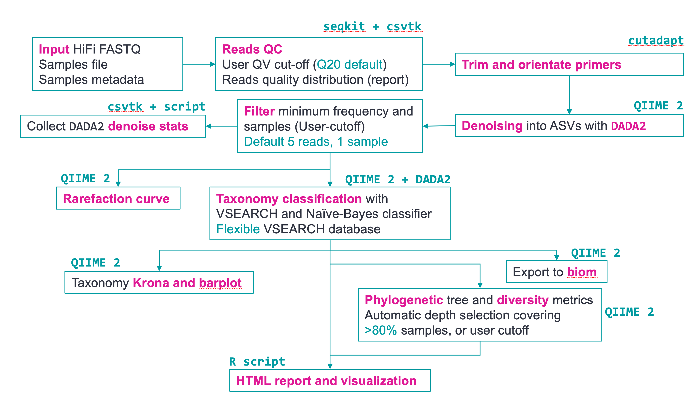

# HiFi Full-length 16S analysis with pb-16S-nf

- Table of Contents
  * [Workflow overview and output](#workflow-overview-and-output)
  * [Installation and usage](#installation-and-usage)
  * [HPC and job scheduler usage](#hpc)
  * [Run time and compute requirements](#runtime)
  * [Frequently asked questions (FAQ)](#faq)
  * [References](#references)
  * [DISCLAIMER](#disclaimer)

## Pipeline is currently under active development and we welcome feedbacks to improve.

## Workflow overview and output



This Nextflow pipeline is designed to process PacBio HiFi full-length 16S data into high
quality amplicon sequence variants (ASVs) using `QIIME 2` and `DADA2`. It provides a set of visualization 
through the `QIIME 2` framework for interactive plotting. The pipeline generates a HTML report for
the important statistics and top taxonomies. The outputs and stages of this pipeline 
are documented [here](pipeline_overview.md).

We provide an example of report generated using this pipeline based on 8 replicates from the ATCC MSA-1003 
mock community sequenced on Sequel II ([Link](https://www.pacb.com/connect/datasets/)). Right click this 
[link](examples/results/visualize_biom.html?raw=1) and save it on 
your computer, then double click to open the example report. All other important outputs from the pipeline are available
in the [`examples`](examples) folder when you clone this repository.

## Installation and usage
This pipeline runs using Nextflow (Version 22 and above). If you have Singularity or Docker on your
cluster, we recommend using Singularity or Docker to run the pipeline by specifying `-profile singularity` or
`-profile docker` when running the pipeline. Singularity will pull the docker images to the folder `$HOME/nf_conda/singularity`.

By default all softwares dependencies are managed via `Conda`. We recommend installing [`mamba`](https://github.com/mamba-org/mamba)
to speed up the conda environment installation. The default `nextflow.config` file 
enables the use of `mamba` by default. You can install Nextflow following the instruction
from Nextflow [documentation](https://www.nextflow.io/docs/latest/getstarted.html) or via Conda:

```
# (Optional but recommended) Install mamba
conda install mamba -n base -c conda-forge
conda install -c bioconda nextflow

# If this is your first time using conda/mamba
mamba init
```

After installing Nextflow and `mamba`(Optional but recommended), clone the repository and
download databases using the following commands. To update the pipeline in the future, 
simply type `git pull`.

```
git clone https://github.com/PacificBiosciences/pb-16S-nf.git
cd pb-16S-nf
nextflow run main.nf --download_db
```

After downloading the databases, run the following command in the cloned folder
to see the options for the pipeline:

```
nextflow run main.nf --help

  Usage:
  This pipeline takes in the standard sample manifest and metadata file used in
  QIIME 2 and produces QC summary, taxonomy classification results and visualization.

  For samples TSV, two columns named "sample-id" and "absolute-filepath" are
  required. For metadata TSV file, at least two columns named "sample_name" and
  "condition" to separate samples into different groups.

  nextflow run main.nf --input samples.tsv --metadata metadata.tsv \
    --dada2_cpu 8 --vsearch_cpu 8

  By default, sequences are first trimmed with cutadapt (higher rate compared to using DADA2
  ) using the example command below. You can skip this by specifying "--skip_primer_trim"
  if the sequences are already trimmed. The primer sequences used are the F27 and R1492
  primers for full length 16S sequencing.

  Other important options:
  --filterQ    Filter input reads above this Q value (default: 20).
  --max_ee    DADA2 max_EE parameter. Reads with number of expected errors higher than
              this value will be discarded (default: 2)
  --minQ    DADA2 minQ parameter. Reads with any base lower than this score
            will be removed (default: 0)
  --min_len    Minimum length of sequences to keep (default: 1000)
  --max_len    Maximum length of sequences to keep (default: 1600)
  --pooling_method    QIIME 2 pooling method for DADA2 denoise see QIIME 2
                      documentation for more details (default: "pseudo", alternative: "independent")
  --maxreject    max-reject parameter for VSEARCH taxonomy classification method in QIIME 2
                 (default: 100)
  --maxaccept    max-accept parameter for VSEARCH taxonomy classification method in QIIME 2
                 (default: 100)
  --min_asv_totalfreq    Total frequency of any ASV must be above this threshold
                         across all samples to be retained. Set this to 0 to disable filtering
                         (default 5)
  --min_asv_sample    ASV must exist in at least min_asv_sample to be retained.
                      Set this to 0 to disable. (default 1)
  --vsearch_identity    Minimum identity to be considered as hit (default 0.97)
  --rarefaction_depth    Rarefaction curve "max-depth" parameter. By default the pipeline
                         automatically select a cut-off above the minimum of the denoised
                         reads for >80% of the samples. This cut-off is stored in a file called
                         "rarefaction_depth_suggested.txt" file in the results folder
                         (default: null)
  --dada2_cpu    Number of threads for DADA2 denoising (default: 8)
  --vsearch_cpu    Number of threads for VSEARCH taxonomy classification (default: 8)
  --cutadapt_cpu    Number of threads for primer removal using cutadapt (default: 16)
  --outdir    Output directory name (default: "results")
  --vsearch_db  Location of VSEARCH database (e.g. silva-138-99-seqs.qza can be
                downloaded from QIIME database)
  --vsearch_tax    Location of VSEARCH database taxonomy (e.g. silva-138-99-tax.qza can be
                   downloaded from QIIME database)
  --silva_db   Location of Silva 138 database for taxonomy classification
  --gtdb_db    Location of GTDB r202 for taxonomy classification
  --refseq_db    Location of RefSeq+RDP database for taxonomy classification
  --skip_primer_trim    Skip all primers trimming (switch off cutadapt and DADA2 primers
                        removal) (default: trim with cutadapt)
  --colorby    Columns in metadata TSV file to use for coloring the MDS plot
               in HTML report (default: condition)
  --download_db    Download databases needed for taxonomy classification only. Will not
                   run the pipeline. Databases will be downloaded to a folder "databases"
                   in the Nextflow pipeline directory.
  --version    Output version
```

To test the pipeline, run the example below. Note that the path of the database needs
to be changed to their respective locations on your server if it's different (See parameters above). If you 
follow the command above, the databases will be downloaded into a `databases` folder in the `pb-16S-nf` folder
and you do not need to specify the path. Conda environment will by default be created at 
`$HOME/nf_conda` folder unless changed in the `nextflow.config` file. Once the conda environment
is created it will be reused by any future run.

```
# Create sample TSV for testing
echo -e "sample-id\tabsolute-filepath\ntest_data\t$(readlink -f test_data/test_1000_reads.fastq.gz)" > test_data/test_sample.tsv

nextflow run main.nf --input test_data/test_sample.tsv \
    --metadata test_data/test_metadata.tsv -profile conda \
    --outdir results \

# To test using Singularity or docker (change singularity to docker)
nextflow run main.nf --input test_data/test_sample.tsv \
    --metadata test_data/test_metadata.tsv -profile singularity \
    --outdir results \
```

To run this pipeline on your data, create the sample TSV and metadata TSV following
the test data format (For metadata, if you do not have any grouping, you can just
put any words in the "condition" column) and run the workflow similar to the above. 
Remember to specify the `--outdir` directory to avoid overwriting existing results.

## HPC and job scheduler usage <a name="hpc"></a>

The pipeline uses "Local" by default to run jobs on HPC. This can be changed
in the `nextflow.config` file under `executor` to utilize HPC scheduler such as
Slurm, SGE etc using Nextflow's native support. For example, to use Slurm, simply 
open `nextflow.config` file and change `executor = 'Local'` to `executor = 'slurm'` and 
specify the partition to be used using `queue = PARTITION`. See Nextflow 
[documentation](https://www.nextflow.io/docs/latest/executor.html) on the available
executors and parameters. CPUs for `VSEARCH`, `DADA2` and `cutadapt` can be specified as command line
parameters using command line parameters. For all the other processes, they use any of the default
labels in `nextflow.config` and can be changed according to your need.

Note that the `nextflow.config` file by default will 
generate workflow DAG and resources report to help benchmarking the resources
required. See the `report_results` folder created after the pipeline finishes running 
for DAG and resources report.

## Run time and compute requirements <a name="runtime"></a>

We recommend at least 32 CPUs for most sample type. The run time depends highly on the
complexity of the samples in addition to the total number of reads. Shown here are examples of
run time for some data that was tested with this pipeline using 32 CPUs:

|     Sample types      |     Number of samples    |     Number of FL reads    |     Total ASVs    |     Pipeline run time    |     Pipeline max memory    |
|-----------------------|--------------------------|---------------------------|-------------------|--------------------------|----------------------------|
|     Oral              |     891                  |     8.3m                  |     5417          |     2.5h                 |     34 GB                  |
|     Gut               |     192                  |     2.2m                  |     1593          |     2h                   |     30 GB                  |
|     Gut               |     192                  |     2.2m                  |     10917         |     5.5h                 |     30 GB                  |
|     Gut               |     192                  |     16.7m                 |     17293         |     13h                  |     87 GB                  |
|     Wastewater        |     33                   |     2.14m                 |     11462         |     12h                  |     47 GB                  |
|     Mock community    |     264                  |     12.8m                 |     84            |     4h                   |     44 GB                  |

## Frequently asked questions (FAQ) <a name="faq"></a>
* Can I restart the pipeline?

  Yes! Nextflow pipeline can be resumed after interruption by adding the `-resume` option 
  in the `nextflow run` command when you run the pipeline. Nextflow is smart enough to not rerun
  any step if it does not need to. For example, if you want to manually provide the 
  rarefaction/sampling depth after the pipeline finishes, rerun by adding 
  `-resume --rarefaction_depth 5000` and only the steps that uses sampling/rarefaction depth will rerun.
  Of course, any step downstream of those will also rerun.

* Why `cutadapt`?

  The naive Bayes classified in QIIME 2 requires the ASVs to be in the same sequence orientation.
  PacBio's CCS reads have random orientations out of the instrument, hence they need to
  to be oriented first, and this can be done with either `lima` or `cutadapt`. 
  Technically, `lima` has this capability too but it requires BAM input. There are many
  public dataset on SRA that is in FASTQ format and `lima` will not orientate them. Due to the 
  accuracy of HiFi reads, the performance difference between `lima` and `cutadapt` should be
  minimal in our experience.

  Without the read orientation, you will notice that the taxonomy assignments can produce
  weird results (e.g. archea assignment only at the highest taxonomy level).

* A lot of my reads are lost in the denoise stage, what's going on?

  This can happen in extremely diverse community such as soil where the ASVs are of very low abundance.
  In each sample, the reads supporting the ASV are very low and may not pass DADA2 threshold to qualify
  as a cluster. In addition, DADA2 has a strict reads quality filter (maxEE parameter) that will filter
  away reads with relatively low accuracy. 
  See [here](https://github.com/benjjneb/dada2/issues/841) and [here](https://github.com/benjjneb/dada2/issues/1164) 
  for discussions on DADA2 algorithm and reads loss. 

* I'm getting `Conda` "Safety" error indicating corrupted package or that some
pipeline steps are not able to find specific command line tools (e.g. qiime).

  Sometimes the conda cache can become corrupted if you run many workflows
  in parallel before the environment was created, thus causing conflicts between
  the different workflow competing to create the same environment. We recommend running
  the test dataset above and wait for it to finish first so the conda
  environment is created successfully. Subsequent runs will use the same
  environment and will not need to recreate them. Nevertheless, if the errors
  happen, try running `conda clean -a` and remove the offending `conda` packages cache
  in the cache directory (e.g. if the erorr happens for QIIME, delete any folder in `conda info` 
  "package cache" containing QIIME).

  You can try to install the QIIME 2 environment directly to inspect any error
  messages:

  `mamba env create -n q2_test -f qiime2-2022.2-py38-linux-conda.yml`

* I've received/downloaded 16S FASTQ that already has the primers trimmed, can I skip
primers removal?

  We recommend using the pipeline to trim the primers as it works well for HiFi sequencing
  data. However, there are many public dataset that may already have the full length
  primers trimmed, in which case you can specify `--skip_primer_trim` to skip
  primers trimming. If unsure, run with default pipeline and the cutadapt demultiplexing rate
  (in the file `results/samples_demux_rate.tsv`) should be close to zero for all
  samples if the primers are already trimmed.

* How does the taxonomy classification work?

  The "besttax" assignment uses the `assignTaxonomy` Naive-Bayes classifier function from DADA2 
  to carry out taxonomy assignment. It uses 3 databases to classify the ASVs 
  (requiring a minimum bootstrap of 80 using the minBoot parameter) and the priority of assignment
  is GTDB r207, followed by Silva v138, then lastly RefSeq + RDP. This means for example
  if an ASV is not assigned at Species level using GTDB, it will check if it can be assigned
  with Silva. This ensure we assign as many ASVs as possible.

  This process is done first at Species level, then at Genus level. In addition, if any ASV
  is assigned as "uncultured" or "metagenome" (many entries like this in Silva), 
  it will go through the iterative assignment process just like the unclassified ASVs. 
  Note that while this method will assign a high amount of ASVs, there may be issues 
  such as how the taxonomy is annotated in different databases. 

  As such, there is also a VSEARCH taxonomy classification using GTDB database (r207) only in the file called 
  `results/vsearch_merged_freq_tax.tsv` that may provide a more consistent annotation. This uses
  the `classify-consensus-vsearch` plugin from `QIIME 2` and we use the "top-hits" approach
  with a stringent default hit criteria (97% identity) to classify the taxonomy of ASVs.

  The final report will contain statistics from either types of assignment. If you notice a large
  discrepancy, it can be because one method fail to assign a large amount of ASVs from the
  same genus/species. This is likely a database-related bias.

* Some species in MSA 1003 demo data are missing!

  If you run this pipeline by default with PacBio's publicly available
  192-plex replicates ATCC-MSA1003, some 0.02% bacteria may be missing depending on
  which replicates you use due to the default `min_asv_sample` and `min_asv_totalfreq`
  parameters. These bacteria may only have a few reads in 1/2 samples, so they're
  prone to getting filtered out. You can set the two parameters to 0 to disable
  filtering and the bacteria should pop out. However, in real dataset this 
  may result in more false-positives.
  
* Percentage reads classified at species is higher than genus!
  
  You have likely bumped into weird issues with database. For example, there are some microbes
  that has the taxanomy populated at species level, but all the other levels are empty. Unfortunately,
  database curation is hard, and is out of the scope of this pipeline.

* Can I download the databases for taxonomic classification manually?

  The taxonomy classification step of the pipeline requires a few databases that will be downloaded with the
  `--download_db` parameters into a "databases" folder. All the databases are also 
  collected on [Zenodo](https://zenodo.org/record/6912512). These databases can also be downloaded
  manually from the following links if the download script above does not work. The GTDB database
  for VSEARCH will require some processing using the `QIIME 2` package. See `scripts/download_db.sh` for details.
  
  The links for VSEARCH here are for SILVA 138 databases provided by QIIME 2 and do not require further processing. 
  You can also use these if you do not want to use GTDB (default if you run `--download_db` command above).

  - `--vsearch_db` and `--vsearch_tax` provided by the `QIIME 2` community
    - [`silva-138-99-seqs.qza`](https://data.qiime2.org/2022.2/common/silva-138-99-seqs.qza)
    - [`silva-138-99-tax.qza`](https://data.qiime2.org/2022.2/common/silva-138-99-tax.qza)
  - `--silva_db` provided by `DADA2`
    - [`silva_nr99_v138.1_wSpecies_train_set.fa.gz`](https://zenodo.org/record/4587955)
  - `--gtdb_db` provided by `DADA2`
    - [`GTDB_bac120_arc122_ssu_r202_fullTaxo.fa.gz`](https://zenodo.org/record/4735821)
  - `--refseq_db` provided by `DADA2`
    - [`RefSeq_16S_6-11-20_RDPv16_fullTaxo.fa.gz`](https://zenodo.org/record/4735821)

* I want to understand more about OTU vs ASV.

  Zymo Research provides a good article on the difference between ASV and OTU [here](https://www.zymoresearch.com/blogs/blog/microbiome-informatics-otu-vs-asv).
  In addition, [this thread](https://forum.qiime2.org/t/esv-vs-otu-deflation-qiime1-vs-2/14867/2) on
  `QIIME 2` forum discusses the difference in numbers through traditional OTU compared
  to ASV approach.

## References
### QIIME 2
1. Bolyen, E. et al. Reproducible, interactive, scalable and extensible microbiome data science using QIIME 2. Nat Biotechnol 37, 852–857 (2019).
* For individual citations of plugins, you can use the `--citations` command for the relevant plugins. For example, if you want
  to cite `VSEARCH` plugin, type `qiime feature-classifier classify-consensus-vsearch --citations` after activating the conda
  environment. You can activate the environment installed by the pipelines by typing `conda activate $HOME/nf_conda/$ENV` (Change 
  `$ENBV` to the name of the environment you want to activate).
### DADA2
2. Callahan, B. J. et al. DADA2: High-resolution sample inference from Illumina amplicon data. Nat Methods 13, 581–583 (2016).
### Seqkit
3. Shen, W., Le, S., Li, Y. & Hu, F. SeqKit: A Cross-Platform and Ultrafast Toolkit for FASTA/Q File Manipulation. PLOS ONE 11, e0163962 (2016).
### Cutadapt
4. Martin, M. Cutadapt removes adapter sequences from high-throughput sequencing reads. EMBnet.journal 17, 10–12 (2011).
### GTDB database
5. Parks, D. H. et al. A standardized bacterial taxonomy based on genome phylogeny substantially revises the tree of life. Nat Biotechnol 36, 996–1004 (2018).
6. Parks, D. H. et al. A complete domain-to-species taxonomy for Bacteria and Archaea. Nat Biotechnol 38, 1079–1086 (2020).
### SILVA database
7. Yilmaz, P. et al. The SILVA and “All-species Living Tree Project (LTP)” taxonomic frameworks. Nucleic Acids Research 42, D643–D648 (2014).
8. Quast, C. et al. The SILVA ribosomal RNA gene database project: improved data processing and web-based tools. Nucleic Acids Research 41, D590–D596 (2013).
### RDP database
9. Cole, J. R. et al. Ribosomal Database Project: data and tools for high throughput rRNA analysis. Nucleic Acids Res 42, D633–D642 (2014).
### RefSeq database
10. O’Leary, N. A. et al. Reference sequence (RefSeq) database at NCBI: current status, taxonomic expansion, and functional annotation. Nucleic Acids Res 44, D733-745 (2016).
### Krona plot
11. Bd, O., Nh, B. & Am, P. Interactive metagenomic visualization in a Web browser. BMC bioinformatics 12, (2011).
* We use the QIIME 2 plugin implementation here: https://github.com/kaanb93/q2-krona
### Phyloseq and Tidyverse (for HTML report visualization)
12. McMurdie, P. J. & Holmes, S. phyloseq: An R Package for Reproducible Interactive Analysis and Graphics of Microbiome Census Data. PLOS ONE 8, e61217 (2013).
13. Wickham, H. et al. Welcome to the Tidyverse. Journal of Open Source Software 4, 1686 (2019).

## DISCLAIMER
THIS WEBSITE AND CONTENT AND ALL SITE-RELATED SERVICES, INCLUDING ANY DATA, 
ARE PROVIDED "AS IS," WITH ALL FAULTS, WITH NO REPRESENTATIONS OR WARRANTIES 
OF ANY KIND, EITHER EXPRESS OR IMPLIED, INCLUDING, BUT NOT LIMITED TO, ANY 
WARRANTIES OF MERCHANTABILITY, SATISFACTORY QUALITY, NON-INFRINGEMENT OR FITNESS 
FOR A PARTICULAR PURPOSE. YOU ASSUME TOTAL RESPONSIBILITY AND RISK FOR YOUR USE 
OF THIS SITE, ALL SITE-RELATED SERVICES, AND ANY THIRD PARTY WEBSITES OR 
APPLICATIONS. NO ORAL OR WRITTEN INFORMATION OR ADVICE SHALL CREATE A WARRANTY 
OF ANY KIND. ANY REFERENCES TO SPECIFIC PRODUCTS OR SERVICES ON THE WEBSITES 
DO NOT CONSTITUTE OR IMPLY A RECOMMENDATION OR ENDORSEMENT BY PACIFIC BIOSCIENCES.
